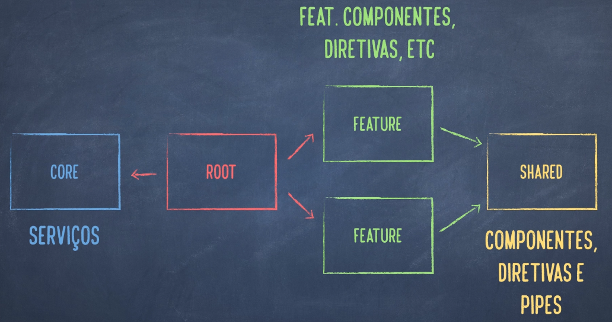

# Nota das aulas do curso De Angular (4,5,6) - Otimiza

-   Curso da Udemy de referencia: https://www.udemy.com/course/angular-pt
-   Documentação oficial: https://www.typescriptlang.org/docs/home.html

## Typescript

-   O uso de ; é opcional

### Declaração de variaveis

```typescript
let message: string = "Help me, Obi-Wan!!!";
let episode: number = 4;
//Observe que como não foi dito o tipo da variavel ele será do tipo 'any'
//O que não é o ideal de usar muitas vezes, uma vez que a ideia do
//typescript é ser um javascript tipado
let favoriteDroid = "BB-8";
```

### Funções

-   São um tipo de dados.
-   Podem possuir nome ou serem anonimas.
-   Tanto o parametro, quanto o retorno podem ser tipados.
-   Podem ser atribuídas a variaveis.

```typescript
function useTheForce(name: string): void {
    console.log("Use the force: " + name);
}

let shortestRun = function(parsecs: number): boolean {
    return parsecs < 12;
};
```

#### Arrow functions

-   (parametro: tipo,...) => implementação;
-   Permite escrever uma função ser utilizar a palavra chave function e return

```typescript
let tieFighters = ships.filter(function(ship) {
    return ship.type === "TieFighter";
});

// Arrow function correspondente
// Obs: Uso do operador Strict Equals ===, pesquise a diferença!
let ties = ships.filter(ship => ship.type === "TieFighter");
```

#### Dizendo que a variavel será uma função

```typescript
let call: (name: string) => void;
// Passando uma arrow function a variavel
call = name => console.log("Do you copy, " + name + "?");

call("R2");
//> Do you copy, R2?
```

#### Parametros opcionais (função)

-   Em javascript todos os parametros são opcionais, em typescript voce é obrigado a informar-los por padrão
-   Para um parametro ser opcional, adicione o sufixo '?'

```typescript
function inc(speed: number, inc?: number): number {
    //Recebe um valor alternativo caso o parametro não seja informado
    let i = inc || 1;
    return speed + i;
}

inc(5, 1);
//> 6

//Informando um valor default logo na declaração.
//Tambem pode ser feito uma chamada de uma outra função
//no lugar do numero, que seja responsável por definir um valor
function inc(speed: number, inc: number = 1): number {
    let i = inc;
    return speed + i;
}

inc(5, 1);
//> 6
```

#### Parametros REST

-   Permite passar inúmeros valores como parametro, sem ter que literalmente criar um array na chamada
-   Chamada mais simples da função
-   préfixo ... antes do nome do parametro do tipo array

```typescript
function countJedis(jedis: number[]): number {
    return jedis.reduce((a, b) => a + b, 0);
}

countJedis([2, 3, 4]);
//> 9

function countJedis(...jedis: number[]): number {
    return jedis.reduce((a, b) => a + b, 0);
}

countJedis(2, 3, 4);
//> 9
```

### Template String

-   Começa e termina com `

```typescript
let isEnoughToBeatMF = function(parsecs: number): boolean {
    return parsecs < 12;
};

let distance = 14;
//Template script e operador ternario
console.log(
    `Is ${distance} parsecs enough to beat Millennium Falcon? ${
        isEnoughToBeatMF(distance) ? "Yes" : "No"
    }`
);
```

### Classes

```typescript
//Forma normal
class Spacecraft {
    propulsor: string;

    constructor(propulsor: string) {
        // É obrigatório o uso do this para se referenciar
        // a uma propriedade ou método da classe
        this.propulsor = propulsor;
    }

    //Para definir um método não se utiliza da palavra chave function
    jumpIntoHyperspace() {
        console.log("Entering hyperspace with " + this.propulsor);
    }
}

//Forma reduzida
class Spacecraft {
    //A propriedade é definida no proprio construtor, como public
    constructor(public propulsor: string) {}
}

let falcon = new Spacecraft("Hyperdrive");
```

### Herança

```typescript
class MillenniumFalcon extends Spacecraft {
    constructor() {
        super("hyperdrive");
    }

    //Sobrescrita do método da classe Spacecraft
    jumpIntoHyperspace() {
        if (Math.random() >= 0.5) {
            //Chamada do método da classe pai/super
            super.jumpIntoHyperspace();
        } else {
            console.log("Failed");
        }
    }
}
```

### Interface

```typescript
interface Containership {
    cargoContainers: number;
}

//Interface pode tambem ser extendida de outras interfaces
interface Smugglership extends Containership {
    hiddenContainers: number;
    //Propriedade opcional
    extraHiddenContainers?: number;
}

class MillenniumFalcon extends Spacecraft implements Containership {
    cargoContainers: number;

    constructor() {
        super("Hyperdrive");
        this.cargoContainers = 4;
    }
}

// Uma função que recebe como parametro qualquer tipo que implementa a interface
function goodForTheJob(ship: Containership): boolean {
    return ship.cargoContainers > 2;
}

let falcon = new MillenniumFalcon();
console.log(goodForTheJob(falcon));
//> true
```

### Import e export - Divisão do programa em módulos

```typescript
//O caminho é relativo ao arquivo de onde sera feito o import
import { Spacecraft, Containership } from "./base-ships";
import { MillenniumFalcon } from "./starfighters";

let ship = new Spacecraft("Hiperdrive");
ship.jumpIntoHyperspace();

let falcon = new MillenniumFalcon();
falcon.jumpIntoHyperspace();
```

```typescript
interface Containership {
    cargoContainers: number;
}

// Para que o arquivo seja um modulo typescript, basta colocar um export
// passando o nome das classes/interfaces... a serem exportadas no fim do arquivo.
// Pode-se tambem colocar a palavra chave export na frente das classes e etc
// a serem exportadas.
export { Containership };
```

### Definição de tipos

-   Tratam-se de arquivos que definem os tipos de uma biblioteca feita em javascript, para que o typescript possa reconhecer.
-   \*.d.ts
-   Voce pode obter essas definições de tipos usando o NPM.

```sh
# Inicializa o npm no seu projeto
npm init

# Instala uma biblioteca ao seu projeto
# o parametro --save indica que a biblioteca é necessária tanto
# em desenvolvimento quanto em runtime
npm install --save lodash@4.14

# Instala uma definição de tipos para o lodash
# o --save-dev indica que é somente necessária durante desenvolvimento
npm install --save-dev @types/lodash@4.14
```

## Angular 4

### Criar um novo projeto com o angular-cli

-   O prefixo é adicionado a cada componente que for criado, util quando usar vários componentes externos e ser capaz de diferenciar do seu.

```sh
ng new myangularproj --prefix=myap
```

### Estrutura de um projeto AngularJS

#### main.ts

-   Arquivo responsável pelo bootstrap do projeto

#### polyfills.ts

-   Serve para incluir scripts que dão suporte e funcionalidades a browsers antigos.

#### src/app/app.module.ts

-   Se trata de um module em Angular, diferente de modulo em ECMAScript (TypeScript/JavaScript)

```typescript
import { BrowserModule } from "@angular/platform-browser";
import { NgModule } from "@angular/core";

import { AppComponent } from "./app.component";

// NgModule é um Decorator
// Decorator é uma função que serve para aplicar metadados
// a uma função,método,classe,argumentos de metodos.
// Nesse caso está sendo aplicada em uma classe AppModule
@NgModule({
    declarations: [AppComponent],
    imports: [BrowserModule],
    providers: [],
    //Diz qual dos componentes listados em declarations
    //que será responsável pelo bootstrap da aplicação
    bootstrap: [AppComponent]
})
export class AppModule {}
```

### O que é um Componente

-   São pequenas partes independentes e reusaveis
-   São classes com um determinado clico de vida
-   Possuem um template para definir uma aparência
-   Possuem um Selector(TAG) para ser usada em outras partes da aplicação

```typescript
import { Component } from "@angular/core";

//Decorator
@Component({
    //  O nome da TAG html
    selector: "app-first",
    // Definição do template usando um arquivo externo
    // Pode ser usado tambem passando uma URL Http
    templateUrl: "./myfirst.component.html",

    // Segunda forma de definição do template
    // Definindo-a direto no decorator
    // Recomendado apenas se o template for pequeno e simples
    template: "<h1>my first component</h1>",

    // Com múltiplas linhas, se usa o ``
    // Templates podem ter expressões que resolvem
    // as propriedades dos componentes, chamado de String Interpolation
    template: `
        <h1>{{ title }}</h1>
        <p>Welcome, {{ user.name }}!</p>
    `
})
export class MyFirstComponent {
    title: string = "My Star Wars Component!";
    user = { name: "Luke Skywalker" };
    constructor() {}
}
```

#### Informando ao angular em qual módulo o componente pertence

```typescript
@NgModule({
    declarations: [MyFirstComponent]
})
export class AppModule {}
```

#### Adicionando um novo componente ao projeto angular

-   O comando abaixo irá gerar um novo diretorio em src/app/
-   Irá criar 3 arquivos {html, css, ts}
-   Automaticamente vai adicionar o componente ao modulo raiz AppModule

```sh
# o --skipTests=true irá fazer com que não crie arquivos de teste
# para o novo componente.
# Obs: Use --spec=false caso use uma versão antiga do angular-cli
ng generate component nomeDoComponente --skipTests=true

# Versão reduzida
ng g c nomeDoComponente --skipTests=true

# Criando um componente dentro de outro
# Seu uso é comum quando o componente está muito relacionado a outro
ng g c restaurants/restaurant --skipTests=true
```

#### Property Binding

-   Serve para linkar o valor da propriedade de um elemento do DOM, a uma expressão angular
-   Sintaxe [], de "One-Way Binding"
-   Pode ser aplicada a qualquer propriedade do [DOM](https://www.w3schools.com/whatis/whatis_htmldom.asp)

```typescript
//No componente
user = {
    name: "Luke Skywalker",
    isJedi: true
};
```

```html
<!--No template do coponente-->
<!--Sempre que o valor de user mudar, vai mudar no input tambem-->
<input type="text" [value]="user.name" />

<!--Se o user não for um jedi, essa div sera ocultada-->
<div [hidden]="!user.isJedi">
    <!-- Pequena nota sobre html/css
    A propriedade hidden do DOM é controlada via CSS
    Então se voce alterar o display da Div em um CSS global
    pode influenciar na visibilidade desse elemento.
    -->
    location of the jedi temple
</div>

<!--Caso isJedi for true, o angular vai adicionar a classe light na div -->
<div [class.light]="user.isJedi"></div>
<div class="light"></div>
```

#### Passando dados aos componentes

-   Atribuição de valores as propriedades do componente

```typescript
// Deve se importar o decorator Input
import { Component, Input } from "@angular/core";

@Component({
    selector: "mt-header",
    template: "<h1>{{title}}</h1>"
})
export class HeaderComponent {
    // Adicionando o decorator input ao atributo
    @Input() title: string;

    //Pode-se tambem expor o atributo com outro nome
    @Input("value") title: string;

    @Input() randomBool: boolean;
}
```

```html
<!--usando o header em outro componente-->
<mt-header title="Minha App"></mt-header>

<!--Resultado do código acima no DOM -->
<mt-header title="Minha App">
    <!--Template do component-->
    <h1>Minha App</h1>
</mt-header>

<!--Usando template interpolation-->
<mt-header title="{{isJedi ? 'Jedi' : 'Sith'}}"></mt-header>

<!--Usando property binding-->
<mt-header [title]="isJedi ? 'Jedi' : 'Sith'"></mt-header>

<!--Usando o nome definido em @Input-->
<mt-header value="Título"></mt-header>

<!--Para passar um boleano, numero ou qualquer coisa diferente de uma string literal-->
<!--Voce deve usar property binding, senão rambomBool recebe a string "true"-->
<mt-header title="Exemplo" [randomBool]="true"></mt-header>
```

### Diretivas

-   Componentes são diretivas com template.
-   Servem para adicionar comportamento a um elemento do DOM.
-   Existem 3 tipos de diretivas:
    1. componentes
    2. estruturais
    3. de atributos

#### Diretiva ngIf

-   Diretiva estrutural, trabalha com o padrão de template do HTML5
-   Permite renderizar um conteudo caso a expressão associada seja verdadeira.
-   Alternativa melhor ao uso da propriedade 'hidden' do DOM.

```html
<!--ng if -->
<input type="text" [value]="user.name" />
<!--Uso de forma abreviada, com o * na frente (recomendada)-->
<div *ngIf="user.isJedi">
    location of the jedi temple
</div>

<!--Versão não-abreviada-->
<input type="text" [value]="user.name" />
<template [ngIf]="user.isJedi">
    <div>
        location of the jedi temple
    </div>
</template>
```

#### Diretiva ngFor

-   Irá repetir o conteudo de um elemento para cada item de uma coleção de objetos.
-   Por ser estrutural irá repetir o template do elemento.

```html
<!--ng for-->
<ul>
    <li *ngFor="let user of users">{{user.name}}</li>
</ul>

<!--nf for com index-->
<ul>
    <li *ngFor="let user of users; let i=index">
        {{i+1}} - {{user.name}}
    </li>
</ul>
```

#### Diretiva ngSwitch

-   Avalia uma expressão.
-   Usa da diretiva ngSwitchCase para mostrar o conteudo equivalente.
-   Funcionamento semelhante a um switch case comum em programação.

```html
<div [ngSwitch]="profile">
    <p *ngSwitchCase="root">You can read & write</p>
    <p *ngSwitchCase="user">You can read</p>
    <p *ngSwitchDefault>go back, please!</p>
</div>
```

### Operador de Navegação segura

-   Operador '?'
-   Evita que erros/warnings surgem no Console do browser ao ler uma propriedade de algo não definido.

```html
<div>
    <!--Caso student seja Undefined, não irá tentar ler a propriedade nome-->
    Student: {{student?.name}}
    <div *ngIf="student?.isJedi">
        Jedi Temple: {{student?.temple}}
    </div>
</div>
```

### Eventos de um componente

-   Sem diretivas ng-\*
-   sintaxe - '()'
-   Usa-se () ao redor de um evento para linkar a um método de um componente

```typescript
import { Component } from '@angular/core'

@Component({
    selector: 'mt-clickable',
    template: '<button (click)="clicked()">Click!</button>',

    // Pode se tambem passar uma referencia ao evento usando $event
    // que será passado ao método, e então poderá ser inspecionado.

    // Em certos tipos de evento como keydown, voce pode associar a tecla
    // separado por ponto.
    template: '<input (keydown.space)="keyDown($event)">'
})
export class ClickableComponent {
    clicked(): void {
        console.log("Button clicked!")'
    }
    keyDown(event): void {
        console.log(`Key down: ${event}`)
    }
}
```

### Emitindo eventos em um Componente

```typescript
import { Component, Output, EventEmitter } from "@angular/core";

@Component({
    selector: "mt-clickable",
    template: '<button (click)="clicked()">Click!</button>'
})
export class ClickableComponent {
    // O decorator Output, ao invés de dizer que a propriedade recebe valores,
    // significa que ela emite eventos, a saida do componente.

    // O nome do evento por padrão é o nome da propriedade.
    @Output() myEvent = new EventEmitter();

    clicked(): void {
        //Emite de fato o evento
        this.myEvent.emit();
    }

    //Metodo que sera executado quando o myEvent for disparado
    willBeCalled(): void {
        console.log("Event from clickable");
    }
}
```

```html
<!--no template que usa o componente-->
<mt-clickable (myEvent)="willBeCalled()"></mt-clickable>
```

### Váriaveis de template

-   Servem para criar uma referencia a um elemento do DOM ou componente.
-   Permite usar uma referencia do elemento dentro do template HTML, ou passar como parametro a um método.
-   Prefixo #

```html
<!--Exemplo feito no arquivo src/app/student/student.component.html-->
<div *ngIf="student">
    Student: <a href="#" (click)="clicked()">{{student?.name}}</a>
    <div *ngIf="student?.isJedi">
        Jedi Temple: {{student?.temple}}
        <!--Uso da referencia de textarea-->
        <button (click)="description.focus()">Focus!</button><br />
        <!--Declaração da variavel de template description-->
        <textarea #description></textarea>
    </div>
</div>
<p *ngIf="!student">
    Sem dados para exibir
</p>
```

### Rotas

-   Tornam a pagina dinamica.
-   Permite que troque um componente para outros em seu lugar.
-   É necessário mapear cada componente em uma rota.
-   Uso do Tipo Routes do AngularJS.
-   Uso da diretiva routerLink para navegar nas rotas.

```html
<!-- No template do componente -->
<div>
    <!-- Componente fixo -->
    <mt-header></mt-header>
</div>
<div>
    <!-- Componente dinamico usando rotas -->
    <router-outlet></router-outlet>
</div>
```

```typescript
// Arquivo src/app/app.routes.ts
import { Routes } from "@angular/router";
import { HomeComponent } from "./home/home.component";
import { AboutComponent } from "./about/about.component";

export const ROUTES: Routes = [
    { path: "", component: HomeComponent },
    { path: "about", component: AboutComponent }
];
```

```typescript
// Arquivo src/app/app.modules.ts
import { RouterModule } from "@angular/router";

import { ROUTES } from './app.routes';

@NgModule({
    declarations: [...],
    imports: [..., RouterModule.forRoot(ROUTES)],
})
export class AppModule { }
```

#### routerLink

-   É uma diretiva
-   Diretiva usada para poder navegar pelas rotas
-   Recebe o respectivo caminho

```html
<!-- no template de algum componente, passando o caminho -->
<a routerLink="/restaurants">Restaurantes</a>
<!-- ou usando property binding e passando um array -->
<a [routerLink]="['/restaurants']">Restaurantes</a>
```

#### routerLinkActive

-   É uma diretiva
-   Aplica uma classe CSS a um elemento quando uma rota estiver ativa.
-   Pode ser usado em qualquer elemento pai relativo a onde está o routerLink.

```html
<!-- Descrição de comportamento:
    Nesse exemplo, quando for no texto Sobre, localizado em uma barra
    de navegação, ele irá exibir o componente About e o routerLinkActive
    vai aplicar uma classe CSS chamada 'active' no elemento 'li' relativo ao
    routerLink, que irá destacar o "botão" do Sobre.
-->
<div class="collapse navbar-collapse pull-left" id="navbar-collapse">
    <ul class="nav navbar-nav">
        <li routerLinkActive="active"><a href="#">Restaurantes</a></li>
        <li routerLinkActive="active">
            <a [routerLink]="['/about']">Sobre</a>
        </li>
    </ul>
</div>
```

### Injeção de Dependência

-   É um padrão de projeto
-   A aplicação deixa de instanciar seus objetos manualmente e passa a depender do framework para obter os objetos que ela quer usar.
-   O framework gerencia a instanciação dos objetos, assim como suas dependencias, disponibilizando para os componentes da aplicação.

```typescript
@Component({
    // Informando ao angular o que será injetado
    // Para o componente e os filhos.
    providers: [MyFirstService],

    // Informando ao angular o que será injetado
    // Somente para o componente
    viewProviders: [MyFirstService]
})
export class MyFirstComponent {
    // Ao invés de instanciar um servico/dependência dentro
    // do construtor, o componente pode receber o serviço
    // diretamente pronto como argumento, a vantagem é que
    // se o serviço depender de outro objeto, o componente não
    // precisa se preocupar em instancia-lo
    // constructor() {this.firstService = new MyFirstService}

    constructor(private firstService: MyFirstService) {}
}
```

```typescript
// Informando ao angular o que será injetado
// diretamente no Modulo, irá se aplicar a mesma instancia
// a todos os componentes nesse Modulo
@NgModule({
    declarations: [...],
    providers: [ MyFirstService ]
})
export class AppModule {}
```

### Serviços

-   Classes que podem ser usadas para injetar em outros componentes ou serviços.
-   São geralmente usados para encapsular o acesso a API's de backend.
-   Podem ser singletons: são ótimos candidatos a guardar dados compartilhados para toda a aplicação.
-   Tambem podem guardar dados para somente parte de uma aplicação.

```typescript
import { Injectable } from "@angular/core";
import { Http } from "@angular/http";

// Decorator, não é necessário para que o seu serviço seja
// injetado em outro objeto, mas sim para que ele possa receber
// injeções do framework
@Injectable()
export class MyService {
    constructor(private http: Http) {}

    list() {
        return this.http.get("/url");
    }
}
```

### Alguns serviços

#### Title

-   Serviço para obter e alterar o titulo de uma página.
-   Um componente pode requisitar a injeção e usar um método para trocar o titulo.
-   Esse serviço existe porque não é possível usar expressões angular na pagina html inteira, como o titulo fica no Head e essa parte não faz parte do bootstrap, foi criado o serviço title.

```typescript
import { Title } from "@angular/plataform-browser";

@Component({
    viewProviders: [Title]
})
export class MyPageComponent {
    constructor(title: Title) {
        title.setTitle(":: MyFancy Title ::");
    }
}
```

#### Http

#### Router

### Métodos do ciclo de vida - OnInit

-   Sempre que é criado um componente com o angular-cli, ele automaticamente implementa a interface OnInit.
-   O método ngOnInit() será chamado uma vez no clico de vida do componente.

```typescript
// Arquivo src/app/restaurants/restaurants.component.ts
import { Component, OnInit } from "@angular/core";
import { Restaurant } from "./restaurant/restaurant.model";
import { RestaurantsService } from "./restaurants.service";

@Component({
    selector: "mt-restaurants",
    templateUrl: "./restaurants.component.html"
})
export class RestaurantsComponent implements OnInit {
    restaurants: Restaurant[];

    constructor(private restaurantsService: RestaurantsService) {}

    // Sempre que o componente entrar na tela, e todas as dependencias e
    // injeções tiverem sido atribuidas ao componente, o método ngOnInit
    // será chamado pelo angular
    ngOnInit() {
        // Momento ideal para fazer a inicialização do componente
        this.restaurants = this.restaurantsService.restaurants();
    }
}
```

### Reactive Programming

-   Resumidamente a ideia é, quando um evento acontece, os interessados são notificados e reagem a ele.
-   Baseado em eventos
-   Os eventos veem em forma de Streams, uma sequencia de eventos que podem ser modificados ou transformados em uma nova cadeia de eventos.
-   REACTIVE = ITERATOR(Passa item por item na stream) + OBSERVER(notifica os listeners interessados)
-   Angular utiliza da biblioteca RXJS para Reactive Programming

#### RXJS

-   Os metodos da API http retornam Observable<Response>, um dos objetos principais do RXJS.
-   Permite coisas interessantes como, por exemplo, facilmente refazer as chamadas http usando o método retry de Observable.
-   Permite fazer múltiplos mapeamentos até que a resposta seja da forma como voce espera.

```typescript
this.http
    .get("/url")
    .retry(2)
    .map(response => response.json())
    .subscribe(data => (this.mydata = data));

this.http
    .post("/url", JSON.stringify(myData))
    .map(response => response.json())
    .map(result => result.id)
    .subscribe(id => (this.id = id));
```

#### Observable vs Promises

-   Observables continuam disparando eventos até que sejam explicitamente fechados.
-   Promises são consideradas resolvidas depois do primeiro evento.
-   Observables são mais flexíveis, pois, por exemplo, possuem capacidade de usar WebSockets.

#### Subscribe/Unsubscribe

-   Um Observable só é "executado" quando um objeto se inscreve nele, até então ele é como um "corpo".
-   Quando um objeto se inscreve em um Observable, é necessário remover a inscrição posterior para evitar Memory Leaks.
-   Mesmo quando um componente sai da tela, um listener que foi inscrito pode continuar sendo chamado.
-   Os Observable retornados pela API http, pelos parametros do router e pelo Pipe Async, não precisam de cancelamento de inscrição.

### Tratamento de Erros com o Operador Catch

-   Trechos de código do projeto do Curso, com uso de catch() e função externa para gerenciar erros.

```typescript
// arquivo src/app/restaurants/restaurants.service.ts
import { MEAT_API } from "../app.api";
import { Injectable } from "@angular/core";
import { Http } from "@angular/http";
import { Observable } from "rxjs/Observable";
import "rxjs/add/operator/map";
import "rxjs/add/operator/catch";
import { ErrorHandler } from "../app.error-handler";

@Injectable()
export class RestaurantsService {
    constructor(private http: Http) {}

    restaurants(): Observable<Restaurant[]> {
        return (
            this.http
                .get(`${MEAT_API}/restaurants`)
                /*
                O map está sendo responsável em "converter"
                o Observable<Response> do get para um
                Observable<Restaurants[]>.

                O método .json() vai obter um json do Corpo
                do Response, sendo este compatível com o tipo Restaurant[].
                A conversão do json para Restaurants[] ocorre implicitamente.
                */
                .map(response => response.json())
                .catch(ErrorHandler.handleError)
        );
    }
}
```

```typescript
// arquivo src/app/app.error-handler.ts
import { Response } from "@angular/http";
import { Observable } from "rxjs/Observable";

export class ErrorHandler {
    static handleError(error: Response | any) {
        let errorMessage: string;
        if (error instanceof Response) {
            errorMessage = `Erro ${error.status} ao acessar a URL ${error.url} - ${error.statusText}`;
        } else {
            errorMessage = error.toString;
        }
        console.log(errorMessage);
        return Observable.throw(errorMessage);
    }
}
```

```typescript
import { Component, OnInit } from "@angular/core";
import { Restaurant } from "./restaurant/restaurant.model";
import { RestaurantsService } from "./restaurants.service";

@Component({
    selector: "mt-restaurants",
    templateUrl: "./restaurants.component.html"
})
export class RestaurantsComponent implements OnInit {
    restaurants: Restaurant[];

    constructor(private restaurantsService: RestaurantsService) {}

    ngOnInit() {
        // O subscribe irá obter o Restaurants[] do Observable
        // retornado pelo método restaurants() de restaurantsService
        this.restaurantsService
            .restaurants()
            .subscribe(restaurants => (this.restaurants = restaurants));
    }
}
```

### Parametrizando as Rotas

-   Existem duas formas de obter parâmetros: a partir de snapshot ou subscribe.
-   Snapshots são uteis quando a gente não se preocupa se a rota vai mudar, e o componente sai da tela, e volta depois.
-   Subscribe é utilizado quando o componente continua na tela, mas precisa se atualizar quando um item for acionado.

```typescript
export const ROUTES: Route = [
    // Um caminho pode ser parametrizado passando :nome
    { path: "restaurant/:id", component: RestaurantComponent }
];
```

```html
<!-- Passando um valor para o parâmetro -->
<a [routerLink]="['/restaurant', restaurant.id]">Bakery</a>
```

```typescript
export class MyComponent implements OnInit {
    myObj: any

    // O objeto ActivatedRoute representa a rota ativa no momento
    constructor(private route: ActivatedRoute){ }

    // Snapshot
    ngOnInit(){
        // Obtendo o valor do parametro ID usando snapshot
        const id = this.route.snapshot.params['id']
        // Uma vez obtido o valor, voce pode consultar o seu backend para
        // obter a informação
        this.myObj = // ...obter os dados baseado no id
    }

    // Subscribe
    ngOnInit(){
        this.route.params.subscribe(params => {
            const id = params['id']
            this.myObj = // ...obter os dados baseado no id
        })
    }
}
```

### Rotas Filhas dentro de outros componentes

-   Utiliza-se o elemento children, que é do tipo Routes tambem.
-   Após definir as rotas filhas, basta criar um novo route-outlet no html do componente pai, e usar routerLink para um botão trocar de rota.

```typescript
import { Routes } from "@angular/router";
...

export const ROUTES: Routes = [
  { path: "", component: HomeComponent },
  { path: "restaurants", component: RestaurantsComponent },
  {
    path: "restaurants/:id",
    component: RestaurantDetailComponent,
    children: [
        //Define um dos componentes como padrão a ser mostrado
      { path: "", redirectTo: "menu", pathMatch: "full" },
      { path: "menu", component: MenuComponent },
      { path: "reviews", component: ReviewsComponent }
    ]
  },
  { path: "about", component: AboutComponent }
];
```

### Pipes

-   São responsáveis por uma transformação de dados para uma apresentação diferente.
-   Chamados de filtros em Angular I
-   Com pipes voce consegue transformar uma string em uppercase, lowercase, formatar números, moedas, datas...
-   Os parâmetros de um Pipe são separados por `:`

```typescript
//in component
user: = {name: 'Luke Skywalker', isJedi: true}
```

```html
<!-- in template -->
<div>{{user | json}}</div>
<!-- renderizado -->
<div>{ name: 'Luke Skywalker', isJedi: true }</div>

<!-- in template -->
<div>{{user.name | uppercase}}</div>
<!-- renderizado -->
<div>LUKE SKYWALKER</div>

<!-- in template -->
<div>{{user.name | lowercase}}</div>
<!-- renderizado -->
<div>luke skywalker</div>

<!-- in template -->
<div>{{0.5 | percent}}</div>
<!-- renderizado -->
<div>50%</div>

<!-- in template, com parametros -->
<div>{{birthday | date: 'dd/MM/yyyy'}}</div>
<!-- renderizado -->
<div>12/12/1994</div>

<!-- in template -->
<div>{{price | currency}}</div>
<!-- renderizado -->
<div>USD45.90</div>

<!--
    in template, com o primeiro parametro indicando moeda
    e o segundo se é pra usar o simbolo no lugar da sigla
-->
<div>{{price | currency: 'BRL' : true}}</div>
<!-- renderizado -->
<div>R$45.90</div>

<!-- in template -->
<div>{{user.name | slice: 0:4}}</div>
<!-- renderizado -->
<div>Luke</div>

<!-- in template -->
<div>{{['one', 'two'] | slice: 0:1 | json | uppercase}}</div>
<!-- renderizado -->
<div>["ONE"]</div>

<!-- Pipe Async
    Ao invés de fazer o subscribe dentro do componente, obter a resposta e
    atribuir a uma propriedade interna, o Pipe async vai ele mesmo fazer o subscribe,
    obter os dados e iterar sobre ele.
    Como vantagem o código fica mais limpo.
-->
<div class="box-body" *ngFor="let review of reviews | async">
    <p>{{review.frase}}</p>
</div>
```

### Localizando Preços para a moeda brasileira

-   Por padrão o Pipe currency usa o padrão americano.
-   Adiciona-se o pacote intl, para lidar com Internacionalização.

```sh
npm install --save intl
```

```typescript
// No arquivo src/polyfills.ts
import "intl";
import "intl/locale-data/jsonp/pt-BR.js";
```

```typescript
// No modulo principal da aplicação, src/app/app.module.ts
...
import { LOCALE_ID } from '@angular/core'

@NgModule({
  declarations: [...],
  imports: [...],
  // Uso da declaração estendida de um provider
  // RestaurantsService == {provide: RestaurantsService, useClass: RestaurantsService}

  // Sempre que um componente pedir esse token LOCALE_ID, ele vai receber o valor pt-BR
  providers: [ RestaurantsService, {provide: LOCALE_ID, useValue: 'pt_BR'} ],
  bootstrap: [AppComponent]
})
export class AppModule { }
```

### Template Forms

-   É uma forma declarativa de configurar os seus formularios no template do componente.
-   Uso da diretiva `ngModel` nos inputs, que devem ser controlados pelo framework.
-   Quando se declara um form em template, o Angular automaticamente associa a diretiva NgForm de forma implicita.
-   Com a diretiva ngForm, pode-se determinar a validade do form, o valor do form e outros status.

```typescript
// no arquivo src/app/app.module.ts
...
import { FormsModule } from "@angular/forms";

@NgModule({
  declarations: [...],
  imports: [..., FormsModule ],
  providers: [...],
  bootstrap: [AppComponent]
})
export class AppModule {}
```

```html
<form>
    <!--Com o uso da diretiva `ngModel`, name é obrigatório.-->
    <!--Uma vez associado essa diretiva, o form passa a estar ciente-->
    <!--do valor do campo, de forma que se o campo for válido,-->
    <!--o form fica válido, e se for inválido, o form tambem.-->
    <input type="text" name="name" `ngModel` />
</form>
```

```typescript
@Compoent({...})
export class UserComponent {
    username: string = "Nome do usuário"
}
```

```html
<form>
    <!-- One-way binding
    Apenas quando o valor no componente mudar, o campo é atualizado
    -->
    <input type="text" name="name" [`ngModel`]="username" />

    <!-- Two-way binding
    Se o campo mudar, o valor no componente é atualizado.
    -->
    <input type="text" name="name" [(`ngModel`)]="username" />
</form>
```

```html
<!--Pode-se obter uma referencia ao ngForm e construir-->
<!--expressoes que ajudam a controlar certos componentes do form-->

<!--O novalidate serve para desabilitar a validação feita pelo browser, -->
<!--uma vez que esta pode mudar de acordo com o browser, e-->
<!--fazer com que o angular seja o responsável pela validação-->
<form novalidate #myForm="ngForm">
    <input type="text" name="name" `ngModel` />
    <input type="text" name="lastname" `ngModel` />
    <input type="text" name="address" `ngModel` />
    <!--Habilitando um botão, baseado na validade do form-->
    <button [disabled]="myForm.invalid" />
</form>
```

#### NgModel

-   Diretiva
-   Disponibiliza os seguintes estados para feedback visual:
    1. (in)valid: Diz se o campo está de acordo com as regras de validação
    2. Pristine: Representa o estado inicial do campo ou form.
    3. Dirty: Representa o estado assim que o usuário digita no campo, não se volta desse estado.
    4. (un)touched: Indica quando o usuário toca/entra no campo.

```html
<form>
    <!--Para saber em que estado um campo se encontra, é necessário-->
    <!--obter uma referencia a diretiva `ngModel`-->
    <input name="name" [`ngModel`]="username" #ipt="`ngModel`" />
    <!--Se o campo for inválido, a mensagem será apresentada-->
    <span *ngIf="ipt.invalid">Nome inválido</span>
</form>
```

#### Validators

-   As validações que se podem atribuir a um campo são:
    1. required: Especifica se um campo é obrigatório
    2. pattern - Regex: Recebe um padrão de expressão regular
    3. {min,max}lenght: Recebe um número e checa se o valor atende o especificado

```html
<form>
    <input
        name="name"
        [`ngModel`]="username"
        #ipt="`ngModel`"
        required
        minlenght="5"
    />
    <span *ngIf="ipt.invalid">Nome inválido</span>
    <input
        name="number"
        [`ngModel`]="number"
        #iptNumber="`ngModel`"
        required
        pattern="^[0-9]*$"
    />
    <span *ngIf="iptNumber.invalid">Número inválido</span>
</form>
```

#### Classes CSS disponíveis para feedback visual

-   ng-valid | ng-invalid
-   ng-pristine | ng-dirty
-   ng-untouched | ng-touched

### Content Projection

-   Utíl para facilitar a reutilização de código
-   Componente container
-   No curso foi abordado como uma das soluções para o seguinte problema:
    -   Quando voce encapsula um input text (campo) de um form em um componente próprio, o form deixa de enxergar o campo.
    -   A solução, com `Content Projection`, é transformar esse componente, em um componente container, onde se aplica apenas o estilo visual e deixa o component parent passar o input text para dentro do container.
-   Uso da tag `<ng-content>`, similar a `<route-outlet>`, representa um espaço onde vai entrar um conteudo, que vai ficar entre as tags do componente.

```html
<!--Arquivo src/app/shared/input/input.component.html-->
<div
    class="form-group"
    [class.has-success]="hasSuccess()"
    [class.has-error]="hasError()"
>
    <label class="control-label sr-only" for="inputSuccess"
        ><i class="fa fa-check"></i> {{label}}</label
    >
    <ng-content></ng-content>
    <span class="help-block" *ngIf="hasSuccess()"
        ><i class="fa fa-check"></i> Ok</span
    >
    <span class="help-block" *ngIf="hasError()"
        ><i class="fa fa-remove"></i> {{errorMessage}}</span
    >
</div>
```

```typescript
// Arquivo src/app/shared/input/input.component.ts
import {
    Component,
    OnInit,
    Input,
    ContentChild,
    //Método de ciclo de vida
    AfterContentInit
} from "@angular/core";
import { NgModel } from "@angular/forms";

@Component({
    //Mudamos o selector para *-container, para deixar claro ser um container
    selector: "mt-input-container",
    templateUrl: "./input.component.html"
})
export class InputComponent implements OnInit, AfterContentInit {
    input: any;
    @Input() label: string;
    @Input() errorMessage: string;

    // Com o decorator ContentChild voce pode obter uma referencia
    // a uma diretiva, ou elemento.
    @ContentChild(NgModel) model: NgModel;

    constructor() {}

    ngOnInit() {}

    // Método que será chamado quando o conteudo que irá ficar
    // no lugar do <ng-content> for definido
    ngAfterContentInit() {
        // Momento ideal para checar se ngModel existe, e o
        // para pegar a referencia ngModel e atribuir ao input
        this.input = this.model;
        // Verifica se o conteudo possui uma tag ngModel
        if (this.input === undefined) {
            throw new Error(
                "Esse componente precisa ser usado com uma diretiva ngModel"
            );
        }
    }

    hasSuccess(): boolean {
        return this.input.valid && (this.input.dirty || this.input.touched);
    }

    hasError(): boolean {
        return this.input.invalid && (this.input.dirty || this.input.touched);
    }
}
```

```html
<!--Arquivo src/app/order/order.component.html-->
<!--Arquivo de template do Component Parent, que irá conter o container-->
<div class="col-sm-6 col-xs-12">
    <!--Uso do componente container-->
    <mt-input-container
        errorMessage="Campo obrigatório e com min. 5 caracteres"
        label="Número"
    >
        <!--O input será o conteudo que irá substituir o ng-content-->
        <input
            class="form-control"
            name="address"
            ngModel
            required
            placeholder="Endereço"
            minlength="5"
        />
    </mt-input-container>
</div>
```

### ControlValueAccessor

-   Interface
-   No curso foi abordado como uma das soluções para o seguinte problema:
    -   Quando voce encapsula um input text (campo) de um form em um componente próprio, o form deixa de enxergar o campo.
    -   A solução, com `ControlValueAccessor`, é deixar o componente completamente isolado, com o input, e implementar a interface `ControlValueAccessor` que serve de ponte entre as diretivas de apoio de formulario, como `ngModel`, e o componente.
-   Exemplo abaixo usando um Radio, no lugar de um input text.


```typescript
// Arquivo src/app/radio/radio-option.model.ts
export class RadioOption {
    constructor(public label: string, public value: any) {}
}
```

```typescript
// Arquivo src/app/order/order.component.ts
import { Component, OnInit } from "@angular/core";
import { RadioOption } from "app/radio/radio-option.model";

@Component({
    selector: "mt-order",
    templateUrl: "./order.component.html"
})
export class OrderComponent implements OnInit {
    paymentOptions: RadioOption[] = [
        { label: "Dinheiro", value: "MON" },
        { label: "Cartão de Débito", value: "DEB" },
        { label: "Cartão Refeição", value: "REF" }
    ];
    constructor() {}
    ngOnInit() {}
}
```

```typescript
import { Component, OnInit, Input, forwardRef } from "@angular/core";
import { RadioOption } from "./radio-option.model";
import { ControlValueAccessor, NG_VALUE_ACCESSOR } from "@angular/forms";

@Component({
    selector: "mt-radio",
    templateUrl: "./radio.component.html",
    // Deve-se registrar o componente junto com o provider NG_VALUE_ACCESSOR
    providers: [
        {
            provide: NG_VALUE_ACCESSOR,
            // Passando uma referencia do proprio componente ao provider.
            useExisting: forwardRef(() => RadioComponent),
            multi: true
        }
    ]
})
export class RadioComponent implements OnInit, ControlValueAccessor {
    @Input() options: RadioOption[];

    value: any;

    onChange: any;

    constructor() {}

    ngOnInit() {}

    setValue(value: any) {
        this.value = value;
        this.onChange(this.value);
    }

    // Método da interface ControlValueAccessor
    // É um método chamado pelas diretivas, quando elas querem
    // passar um valor para o seu componente.
    writeValue(obj: any): void {
        this.value = obj;
    }

    // Método da interface ControlValueAccessor
    // É um método chamado pelas diretivas, que recebe uma função que
    // deve ser chamada sempre que o valor interno no componente mudar.
    registerOnChange(fn: any): void {
        this.onChange = fn;
    }

    // Método da interface ControlValueAccessor
    // Não foi feita sua implementação por não ser necessária nesse caso
    // consulte a documentação para mais detalhes.
    registerOnTouched(fn: any): void {}

    // Método da interface ControlValueAccessor
    // Não foi feita sua implementação por não ser necessária nesse caso
    // consulte a documentação para mais detalhes.
    setDisabledState?(isDisabled: boolean): void {}
}
```

```html
<!--Arquivo src/app/radio/radio.component.html-->
<div *ngFor="let option of options">
    <label>
        <div
            (click)="setValue(option.value)"
            class="iradio_flat-red"
            [class.checked]="option.value === value"
            aria-checked="false"
            aria-disabled="false"
            style="position: relative;"
        >
            <ins
                class="iCheck-helper"
                style="position: absolute; top: 0%; left: 0%; display: block; width: 100%; height: 100%; margin: 0px; padding: 0px; background: rgb(255, 255, 255); border: 0px; opacity: 0;"
            ></ins>
        </div>
        {{option.label}}
    </label>
</div>
```

```html
<!--Parte do arquivo src/app/order/order.html-->
<!-- accepted payments column -->
<div class="col-sm-6 col-xs-12">
    <p class="lead">Formas de Pagamento:</p>

    <div class="form-group">
        <mt-radio
            [options]="paymentOptions"
            name="paymentOption"
            ngModel
        ></mt-radio>
    </div>
</div>
<!-- /.col -->
```

### Navegação Programatica via Router

-   Navegando direto na programação:
-   `import { Router } from "@angular/router";`
-   `constructor(..., private router: Router) {}`
-   `this.router.navigate(['/caminho'])`

### Reactive Forms

-   Nova forma do angular de implementar formularios.
-   Em código, criação programatica de formularios.
-   Maior controle na criação de formularios.
-   Associação no template.
-   Ao invés de usar `ngModel` e configurar validadores nos campos, iremos criar instancias de `formGroup`, ou `formControl`, dentro de um componente.
-   A diretiva `formControlName` fornece as mesmas propriedades de estados que `ngModel`.

```typescript
import { BrowserModule } from "@angular/platform-browser";
import { NgModule } from "@angular/core";
// Importando o modulo de Reactive Forms
import { ReactiveFormsModule } from '@angular/forms';
import { AppComponent } from "./app.component";

@NgModule({
    declarations: [AppComponent],
    imports: [BrowserModule],
    // Adicionando o modulo de Reactive Forms na lista de providers
    providers: [..., ReactiveFormsModule],
    bootstrap: [AppComponent]
})
export class AppModule {}
```

```typescript
import { FormGroup, FormBuilder, Validators} from '@angular/forms'
@Component({...})
export class UserComponent implements OnInit {
    userForm: FormGroup

    constructor(private fb: FormBuilder){}

    ngOnInit(){
        this.userForm = this.fb.group({
            username: '',
            password: '',

            // Equivalente ao código acima
            username: this.fb.control(''),
            password: this.fb.control(''),

            // Uso de validadores
            username: this.fb.control('', [Validators.required]),
            password: this.fb.control('', [Validators.minlenght(3)]),

            // Uso de outro form group, para agrupar campos que fazem sentido em conjunto
            // Vantagem: Aplicar validators a nível do grupo para validar valores entre os componentes
            address: this.fb.group({
                street: '',
                zip: ''
            })
        })
    }
}
```

```html
<!--O form será associado ao grupo no componente com a diretiva formGroup-->
<!--O grupo tambem é associado a classes de CSS para facilitar o feedback do usuário-->
<form [formGroup]="userForm">
    <!--Cada componente será associado com formControlName-->
    <input type="text" formControlName="username" />
    <input type="password" formControlName="password" />

    <!--Se tiver outro grupo, este pode ser associado com formGroupName-->
    <div formGroupName="address">
        <input type="text" formControlName="street" />
        <input type="text" formControlName="zip" />
    </div>
</form>
```

#### Validators (Reactive)

-   Equivalente ao template forms, reactive forms tem os seguintes validators padrões:
    -   minlength(..) | maxlength(..)
    -   required
    -   pattern(..)
-   Declarados de forma estática na classe Validators

#### Validators Personalizados

```typescript
import { FormGroup, FormBuilder, Validators, AbstractControl } from '@angular/forms'
@Component({...})
export class UserComponent implements OnInit {
    userForm: FormGroup

    constructor(private fb: FormBuilder){}

    ngOnInit(){
        this.userForm = this.fb.group({
            username: this.fb.control('', [Validators.required]),
            password: this.fb.control('', [Validators.minlenght(3)]),
            email: this.fb.control('', [Validators.required]),
            emailConfirmation: this.fb.control('', [Validators.required])
        },
        // Parametro que aplica um validator a nível de grupo,
        // passando uma função
        {validator: UserComponent.equalsTo}
        )
    }
    static equalsTo(group: AbstractControl): {[key: string]: boolean} {
        //Obtendo uma referencia a um campo do form
        const email = group.get('email')
        const emailConfirmation = group.get('emailConfirmation')
        if(!email || !emailConfirmation){
            //Retornando undefined o validator não será aplicado ao grupo
            return undefined
        }

        if(email.value !== emailConfirmation.value){
            // Retornando uma chave para auxiliar no feedback posterior
            return { emailsNotMatch: true }
        }
        return undefined
    }
}
```

```html
<div class="col-xs-12 col-sm-3">
    <!--Todo grupo, seja através de formGroup, formControlName ou ngModel-->
    <!--possui um método especifico para checar se tem determinado erro-->
    <span
        class="help-block pull-right has-error-block"
        *ngIf="orderForm.hasError('emailsNotMatch')"
    >
        <i class="fa fa-remove"></i> Emails não conferem!
    </span>
</div>
```

### Módulos

-   São itens de configuração do framework.
-   Organização da aplicação.
-   Servem para agregar componentes, diretivas, serviços ou pipes.
-   Pode-se decidir o que será exportado para fora do Modulo e como a injeção de dependencias será configurada.
-   Tipos de módulos:
    -   Root Module:
        -   Módulo raiz que tem a declaração dos componentes usados por toda a aplicação.
        -   Faz o bootstrap da aplicação
    -   Shared Module:
        -   Modulo compartilhado com todos os componentes que são usados por outros módulos da aplicação
    -   Core Module:
        -   Possui todos os serviços da aplicação
        -   Não contem componentes, apenas serviços
        -   Exemplo: HttpModule
    -   Feature Module:
        -   Contem a implementação das funcionalidades da aplicação



-   Para declarar um modulo é necessário uma classe associada ao decorator NgModule.

```typescript
import { NgModule } from "@angular/core";

@NgModule({
    declarations: [...],
    imports: [...],
    providers: [...],
    exports: [...] // Componentes que serão visíveis de fora
})
export class MyModule { }
```

#### Lazy Loading

-   É possível dividir uma aplicação em partes independentes e definir que essas partes não sejam carregadas de imediato, apenas quando requisitadas, com isso o startup da aplicação vai ficar mais rápido porque de inicio as pessoas não vão precisar esperar por algo que elas não vão usar.
-   Lazy loading é fornecido no angular através do RouterModule

```typescript
// arquivo src/app/app.routes.ts
...
import { Routes } from "@angular/router";
import { HomeComponent } from "./home/home.component";

export const ROUTES: Routes = [
    {path: '', component: HomeComponent},
    // Quando o caminho about for acionado ele vai carregar
    // a configuração que está dentro do módulo AboutModule
    {path: 'about', loadChildren: './about/about.module#AboutModule'}
]
```

```typescript
// arquivo src/app/about/about.module.ts
import { NgModule } from "@angular/core";
import { AboutComponent } from "./about.component";
import { Routes, RouterModule } from "@angular/router";

const ROUTES: Routes = [
    // Indicando rota padrão do modulo para o componente About
    { path: "", component: AboutComponent }
];

@NgModule({
    declarations: [AboutComponent],
    // Importando as regras de navegação do AboutModule
    // como esse é um modulo filho, usa-se o método forChild()
    // diferente do modulo principal com forRoot()
    imports: [RouterModule.forChild(ROUTES)]
})
export class AboutModule {}
```

#### Módulo compartilhado

```typescript
import { NgModule } from "@angular/core";
import { InputComponent } from "./input/input.component";
import { RadioComponent } from "./radio/radio.component";
import { RatingComponent } from "./rating/rating.component";
// Modulo que contem as diretivas básicas, importado indiretamente
// pelo BrowseModule no Modulo Raiz
import { CommonModule } from "@angular/common";
// Como o componente de Input usa tanto ReactiveForm quanto NgModel
// é necessário importar-los no Modulo
import { ReactiveFormsModule, FormsModule } from "@angular/forms";

@NgModule({
    declarations: [InputComponent, RadioComponent, RatingComponent],
    imports: [CommonModule, FormsModule, ReactiveFormsModule],
    // Serve para dizer quais componentes pertencentes ao modulo
    // que queremos que possa ser utilizado por outros módulos
    exports: [
        InputComponent,
        RadioComponent,
        RatingComponent,
        // Podemos re-exportar os módulos padrões, dessa forma
        // o modulo que importar o SharedModule não vai precisar importar
        // os módulos abaixo novamente
        CommonModule,
        FormsModule,
        ReactiveFormsModule
    ]
})
export class SharedModule {}
```

#### Relação entre providers e módulos

-   Transcrição do video 79 do curso

Sempre quando declaramos um provider na lista de providers de um componente
estamos limitando a instancia daquele serviço e disponibilizando para o componente
e seus filhos, sempre que eles precisarem do serviço. Podemos dizer que o componente
tem um contexto de injeção de dependência, pra ele esse contexto é hierárquico, porque
ele serve tanto para componentes quanto para os filhos.

O ponto mais alto da hierarquia é um contexto de gestão independente chamado de contexto global.
Esse contexto global pertence ao módulo raiz.

-   E qual seria a relação dos providers com o módulo? Se eu declarar um serviço na lista de providers de um modulo, ele vai ficar disponível apenas para os componentes daquele modulo?

> R: Não e sim, vai depender de como você vai carregar aquele modulo.
> Por padrão um modulo não tem um contexto de injeção de dependencias como tem os componentes e
> como tem o Módulo raiz, na verdade ele não tem. Então sempre que voce declarar um provider na lista de providers de um modulo,
> esses providers são adicionados a lista de providers do modulo raiz, ou seja, no contexto global. Porem isso só vai ser verdadeiro
> se o modulo for carregado junto com o modulo raiz.
>
> Se tivermos um modulo que seja carregado tardiamente, ou seja, via lazy loading, o modulo ganha um contexto de injeção de
> dependência separado, então os providers que estão na lista de providers de um modulo que é carregado tardiamente,
> ele tem um contexto de injeção de dependência isolado do restante da aplicação.

#### Core Module

-   A ideia do core module é evitar uma mudança de comportamento, caso decida-se trocar o modo de carregamento do seu modulo, exemplo: tirar do carregamento junto do modulo raiz (Eager loading) para um carregamento tardio (Lazy Loading).
-   Se for feito como no exemplo acima, e esse modulo tiver muitos providers, voce corre o risco de modificar o comportamento da aplicação, sem perceber muito.
-   Cenario:
    > Voce tem uma aplicação que é carregada totalmente de forma imediata e voce configurou uma lista de providers em vários
    > módulos, mas acabou não percebendo que eles fazem parte, na verdade, da lista de providers, em runtime, do modulo raiz.
    > E então aos poucos você foi decidindo carregar certos módulos de forma tardia, e percebeu que aqueles objetos
    > não estavam mais compartilhando dados entre partes da aplicação.
    >
    > Para consertar esse problema, voce teria que reestruturar a sua aplicação para que isso não aconteça.
-   O core module serve para evitar o cenário acima.
-   Passa-se a ter um modulo isolado, onde voce tem todos os providers da aplicação nesse modulo e esse modulo só é importado no módulo raiz, para evitar caso você venha a declarar um provider na lista de providers de um modulo e ele seja carregado tardiamente, você tenha uma instancia a mais que não era esperada, ali no meio do contexto de injeção de dependências.

#### Adicionando serviços a um modulo compartilhado

-   Permite reduzir a configuração da aplicação.
-   Torna a existência de um Core Module obsoleta, pois permite o SharedModule exercer a mesma função.
-   Angular possui um objeto chamado ModuleWithProviders que permite importar um modulo de forma diferente, uma com os providers e outra sem.
-   Ideal para a situação onde importa-se um modulo em vários outros módulos que são carregados de forma tardia e tambem importa esse modulo no modulo raiz.

```typescript
// Arquivo src/app/shared/shared.module.ts
// Importa-se o ModuleWithProviders
import { NgModule, ModuleWithProviders } from "@angular/core";

// COmponentes do shared module
import { InputComponent } from "./input/input.component";
import { RadioComponent } from "./radio/radio.component";
import { RatingComponent } from "./rating/rating.component";

// Módulos usados nos componentes
import { CommonModule } from "@angular/common";
import { ReactiveFormsModule, FormsModule } from "@angular/forms";

// Serviços que antes pertenciam ao Core Module
import { ShoppingCartService } from "app/restaurant-detail/shopping-cart/shopping-cart.service";
import { OrderService } from "app/order/order.service";
import { RestaurantsService } from "app/restaurants/restaurants.service";

@NgModule({
    declarations: [InputComponent, RadioComponent, RatingComponent],
    imports: [CommonModule, FormsModule, ReactiveFormsModule],
    exports: [
        InputComponent,
        RadioComponent,
        RatingComponent,
        CommonModule,
        FormsModule,
        ReactiveFormsModule
    ]
})
export class SharedModule {
    // Cria-se uma função que retorna o proprio módulo + providers
    static forRoot(): ModuleWithProviders {
        return {
            ngModule: SharedModule,
            providers: [ShoppingCartService, OrderService, RestaurantsService]
        };
    }
}
```

```typescript
// Arquivo src/app/app.module.ts
import { NgModule, LOCALE_ID } from "@angular/core";
import { BrowserModule } from "@angular/platform-browser";
import { HttpModule } from "@angular/http";
import { RouterModule } from "@angular/router";
import { ROUTES } from "./app.routes";
import { AppComponent } from "./app.component";

import { SharedModule } from "./shared/shared.module";

@NgModule({
  declarations: [...],
  imports: [
    BrowserModule,
    HttpModule,
    RouterModule.forRoot(ROUTES),
    // Faz a importação do SharedModule + providers, dispensando o CoreModule
    SharedModule.forRoot()
  ],
  providers: [{ provide: LOCALE_ID, useValue: "pt-BR" }],
  bootstrap: [AppComponent]
})
export class AppModule {}
```

### Pré-carregamento de todos os Módulos em segundo plano

-   Não gera atrasos.
-   Carregamento tárdio em background.
-   Serve para evitar que o usuário perceba uma demora quando um modulo lazy-loading for iniciado.

```typescript
// Arquivo src/app/app.module.ts
import { NgModule, LOCALE_ID } from "@angular/core";
import { BrowserModule } from "@angular/platform-browser";
import { HttpModule } from "@angular/http";
import { RouterModule, PreloadAllModules } from "@angular/router";
import { ROUTES } from "./app.routes";
import { AppComponent } from "./app.component";

@NgModule({
  declarations: [...],
  imports: [
    BrowserModule,
    HttpModule,
    RouterModule.forRoot(ROUTES, {preloadingStrategy: PreloadAllModules}),
  ],
  providers: [{ provide: LOCALE_ID, useValue: "pt-BR" }],
  bootstrap: [AppComponent]
})
export class AppModule {}
```

### Animações

-   Trazem movimento à aplicação
-   O Angular possui um Modulo especifico para animações que é baseada na spec _Web Animations API_.
-   Módulo @angular/animations
-   Possui um Polyfills para browsers que ainda não suportam o _Web Animations API_

```typescript
// Importando as funções para definir a animação
import { trigger, state, style, transition, animate } from "@angular/animations"
@Component({
    // Aplicando a trigger stretch ao template do botão, e associando
    // a propriedade buttonState, quando ela mudar de valor, irá acionar uma
    // transição.
    template: `<button [@stretch]="buttonState">Click</button>`
    animations: [
        trigger('stretch', [
            // definindo os estados da animação
            state('normal', style({width: '40px', opacity: 1})),
            state('stretched', style({width: '120px', opacity: 1})),
            // definindo a velocidade da transição de estados,
            // assim de fato criando uma animação.
            transition('normal => stretched', animate('300ms')),
            transition('stretched => normal', animate('500ms')),

            // Uso do estado especial "*", chamado de wildcard, que representa
            // qualquer estado.
            // O código abaixo diz que para qualquer transição de um estado para outro qualquer,
            // terá uma velocidade de animação de 500ms
            transition('* => *', animate('500ms')),

            // Uso do estado especial "void", que representa o estado em que o componente
            // não está na arvore de componentes do DOM, ou seja, não está na tela.
            // Logo a transição abaixo representa o momento em que o botão entra na tela.
            transition('void => normal', [
                // É tambem possível aplicar estilos na propria transição
                style({opacity: 0, transform: 'translate(-30px, -10px)'}),

                // ease-in / ease-out / ease-in-out mudam como a animação irá acelerar:
                // ease-in significa que o componente entra acelerando;
                // ease-out sai acelerando;
                // ease-in-out é os dois de cima juntos;
                animate('500ms 0s ease-in-out')
                // função animate('duração(ms/s) delay(ms/s) aceleração(easing)')
            ])
        ])
    ]
})
export class ButtonComponent { buttonState = 'normal'}
```

#### Instalação do módulo de animações

```sh
# No curso foi usado a versão 4 para mander a compatibilidade com os outros módulos
npm install --save @angular/animations@4.0.0

# Polyfill
npm install --save web-animations-js
```

```typescript
// arquivo src/polyfills.ts
...
import 'web-animations-js/web-animations.min.js'
```

```typescript
// Arquivo src/app/app.module.ts
import { NgModule, LOCALE_ID } from "@angular/core";
import { BrowserModule } from "@angular/platform-browser";
import { BrowserAnimationsModule } from "@angular/plataform-browser/animations"
import { HttpModule } from "@angular/http";
import { RouterModule, PreloadAllModules } from "@angular/router";
import { ROUTES } from "./app.routes";
import { AppComponent } from "./app.component";

@NgModule({
  declarations: [...],
  imports: [
    BrowserModule,
    // Módulo de animações
    BrowserAnimationsModule,
    HttpModule,
    RouterModule.forRoot(ROUTES, {preloadingStrategy: PreloadAllModules}),
  ],
  providers: [{ provide: LOCALE_ID, useValue: "pt-BR" }],
  bootstrap: [AppComponent]
})
export class AppModule {}
```

#### Usando Observable com Snackbar

-   Usado para que o snackbar desapareça depois de um tempo.
-   A implementação abaixo possui um problema de comportamento.

```typescript
import { Component, OnInit } from "@angular/core";
import {
    trigger,
    state,
    style,
    transition,
    animate
} from "@angular/animations";
import { NotificationService } from "../notification.service";
import { Observable } from "rxjs/Observable";
// Importando o operador Timer de Observable
import "rxjs/add/observable/timer";

@Component({
    selector: "mt-snackbar",
    templateUrl: "./snackbar.component.html",
    styleUrls: ["./snackbar.component.css"],
    animations: [
        trigger("snack-visibility", [
            state(
                "hidden",
                style({
                    opacity: 0,
                    bottom: "0px"
                })
            ),
            state(
                "visible",
                style({
                    opacity: 1,
                    bottom: "30px"
                })
            ),
            transition("hidden => visible", animate("500ms 0s ease-in")),
            transition("visible => hidden", animate("500ms 0s ease-out"))
        ])
    ]
})
export class SnackbarComponent implements OnInit {
    message: string = "Hello there!";

    snackVisibility: string = "hidden";

    constructor(private notificationService: NotificationService) {}

    ngOnInit() {
        this.notificationService.notifier.subscribe(message => {
            this.message = message;
            this.snackVisibility = "visible";
            // Quando uma nova mensagem chegar, irá iniciar um outro observable
            // que irá iniciar um timer, e quando o timer acabar ele vai mudar a
            // visibilidade do snackbar para hidden.

            // Problema: Sempre que o evento de notificação ocorrer, irá ser criado um
            // novo timer, devido a isso irá ocorrer uma competição entre os timers
            // fazendo com que a mensagem suma antes do esperado devido a um timer antigo
            // ter esgotado.
            Observable.timer(3000).subscribe(
                timeout => (this.snackVisibility = "hidden")
            );
        });
    }
}
```

#### Usando os Operadores Do e SwitchMap

-   Resolve o problema de concorrência da implementação acima
-   Diferença do `subscribe` e `do`:
    -   O subscribe coloca um listener no `Observable` e só apartir desse ponto que o `Observable` vai notificar, diferentemente, o `do` permite executar uma ação no instante que chega a mensagem, ele faz parte da configuração, apenas com o `do` o `Observable` não vai ainda mandar mensagens.
-   O `switchMap` vai trocar o `Observable` Inteiro, permite o encadeamento de `Observable`, mas permitindo usar apenas um `subscribe`.
-   Com a implementação abaixo, não vai ocorrer o problema acima devido a um comportamento especial do switchMap, ele faz automaticamente um `unsubscribe` se quando uma nova mensagem chegar, o `Observable` antigo estiver ativo, ou seja, ele abandona o timer dele pelo novo.

```typescript
// Importa-se os operadores do e switchMap
import 'rxjs/add/operator/do'
import 'rxjs/add/operator/switchMap'

@Component({...})
export class SnackbarComponent implements OnInit {
  message: string = "Hello there!";

  snackVisibility: string = "hidden";

  constructor(private notificationService: NotificationService) {}

  ngOnInit() {
    this.notificationService.notifier.do(message => {
      this.message = message
      this.snackVisibility = 'visible'
    }).switchMap(message => Observable.timer(3000))
    .subscribe(timeout => this.snackVisibility = 'hidden')
  }
}
```

#### Animações com Keyframes

-   Animação que contem vários marcos, ou passos.
-   Cada passo possui um estilo de css diferente.
-   Permite criar animações um pouco mais complexas.
-   Os pontos, onde uma animação tem que mudar, são chamados de KeyFrames.
-   Cada KeyFrame possui um estilo único, que representa o estado de um objeto.

```typescript
import {
    trigger,
    state,
    style,
    transition,
    animate,
    keyframes
} from "@angular/animations";
@Component({
    animations: [
        trigger("tgr", [
            ...,
            transition("st1 => st2", [
                animate(
                    "500ms 0s ease-in-out",
                    keyframes([
                        // offset: 0 significa o inicio da animação
                        style({ transform: "transform(0px, 0px)", offset: 0 }),
                        // offset: 0.6 significa 60% da animação
                        style({
                            transform: "transform(100px, 0px)",
                            offset: 0.6
                        }),
                        // offset: 1 significa o fim da animação
                        style({
                            transform: "transform(140px, -30px)",
                            offset: 1
                        })
                    ])
                )
            ])
        ])
    ]
})
export class MyComponent {}
```

### Rotas com Wildcard (Página não encontrada)

-   Rota a ser usada, caso não bata com nenhuma outra.

```typescript
import { Routes } from "@angular/router";
import { HomeComponent } from "./home/home.component";
import { NotFoundComponent } from "./not-found/not-found.component";

export const ROUTES: Routes = [
    { path: "", component: HomeComponent },
    ...,
    // Wildcard, deve-ser a ultima rota devido ao
    // funcionamento do Router, que é similar a um switch case
    { path: "**", component: NotFoundComponent }
];
```

### Construindo a Aplicação

-   No build de produção, o Typescript é traduzido em Javascript
-   HTML é convertido em typescript e depois em Javascript, que irá gerar os códigos dos templates
-   Todo o código não utilizado é removido.
-   Todo o código gerado passa por um minify, ou seja, é removido os espaços, quebras de linha e comentarios para melhorar o carregamento da página ao reduzir o tamanho dos arquivos.
-   Todo o código gerado passa por um Uglify que irá renomear alguns nomes de variaveis e funções para versões reduzidas, por exemplo, passando a ter uma letra como nome de variavel/função.

```sh
# Compilação Just-in-time
# Faz uma build com as configurações de desenvolvimento, o mesmo do ng serve.
# Tambem gera arquivos *.map para permitir o debug ao mapear o código em javascript
# ao escrito em Typescript.
# A compilação dos templates html para javascript ocorre direto no Browser, pois o angular
# passa o código desse "compilador" na build.
ng build

# Compilação Ahead-of-time
# Faz um build para produção, sem *.map.
# Ocorre a minificação e a conversão dos templates para typescript e depois Javascript.
# Diferente do build acima, a compilação dos templates ocorre antes da aplicação vir ao browser,
# logo menos código do framework é passado na compilação final.
ng build --prod

# Para mudar o url base do projeto
ng build --prod --bh=/url/

# É tambem possível subir um servidor com as configurações de produção, a diferença é que
# ele não vai produzir os arquivos na pasta dist.
ng serve --prod
```

### Modificando a estratégia de navegação (Hash)

-   Modificamos a forma como angular fará a navegação para `Hash`, antigo padrão nas primeiras versões do angular.
-   Mudando a estrátegia de navegação para `Hash`, adequamos a aplicação a servidores http mais tradicionais, em que voce não tem acesso ao ambiente e não pode configurar uma regra onde o 404 leve novamente para o index.html, em servidores http modernos e atuais, como apache e entre outros, não é necessário mudar a estratégia de navegação na aplicação, basta apenas configurar o servidor para quando não encontrar a pagina requisitada ele retornar ao browser o `index.html`.
-   Com o `Hash` sempre que tiver uma requisição a uma rota especifica, será passado um indice com todas as rotas da aplicação, assim o servidor deixa de lidar com as rotas por sí.
-   Sem usar essa estrátegia de navegação por padrão, quando rodar o build de produção em um servidor, ele não irá encontrar uma rota como: `http://localhost:8000/restaurants/bread-bakery/menu`, pois este foi gerado pela aplicação e não é um caminho real de arquivos que o browser buscaria.
-   Com o uso da estrátegia Hash, por padrão os caminhos na aplicação ficaram como `http://localhost:8000/#/restaurants/bread-bakery/menu`.

```typescript
// Arquivo src/app/app.module.ts
import { NgModule, LOCALE_ID } from "@angular/core";
import { BrowserModule } from "@angular/platform-browser";
import { BrowserAnimationsModule } from "@angular/plataform-browser/animations"
import { HttpModule } from "@angular/http";
import { RouterModule, PreloadAllModules } from "@angular/router";
// Importa-se a estrátegia Hash
import { LocationStrategy, HashLocationStrategy } from '@angular/common'
import { ROUTES } from "./app.routes";
import { AppComponent } from "./app.component";

@NgModule({
  declarations: [...],
  imports: [
    BrowserModule,
    BrowserAnimationsModule,
    HttpModule,
    RouterModule.forRoot(ROUTES, {preloadingStrategy: PreloadAllModules}),
  ],

  // Informa ao angular para usar a estrátegia Hash
  providers: [{provide: LocationStrategy, useClass: HashLocationStrategy}, { provide: LOCALE_ID, useValue: "pt-BR" }],
  bootstrap: [AppComponent]
})
export class AppModule {}
```

## Extras

### Observable valueChanges de Reactive Forms

-   [valueChanges](https://angular.io/guide/observables-in-angular#reactive-forms)
-   No curso foi usado a propriedade valueChanges de FormControl, que é um Observable.
-   Quem se increver nessa propriedade é notificado de mudanças no valor do campo.

### Operadores debounceTime e distintUntilChanged

-   [debounceTime](https://rxjs-dev.firebaseapp.com/api/operators/debounceTime)
-   O debounceTime só vai emitir o observable se a diferença entre 2 eventos for maior que o tempo informado
-   [distinctUntilChanged](https://rxjs-dev.firebaseapp.com/api/operators/distinctUntilChanged)
-   O distinctUntilChanged só vai emitir o observable se seu valor foi diferente do anterior.

```typescript
//imports usados
...
import { FormBuilder, FormGroup, FormControl } from "@angular/forms";
import "rxjs/add/operator/switchMap";
import "rxjs/add/operator/debounceTime";
import "rxjs/add/operator/distinctUntilChanged";
import "rxjs/add/operator/catch";
import "rxjs/add/observable/from";
import { Observable } from "rxjs/Observable";
...

// O código abaixo ira fazer com que, sempre que um valor mudar na barra de busca
// ele espere 500ms entre uma mudança e outra para lançar outro evento
// e que eles sejam diferentes entre si, para então atualizar a lista de restaurantes a serem
// exibidos.
this.searchControl.valueChanges
    .debounceTime(500)
    .distinctUntilChanged()
    .do(searchTerm => console.log(`q=${searchTerm}`))
    .switchMap(searchTerm =>
        this.restaurantsService
            .restaurants(searchTerm)
            // O catch serve para evitar que o observable valueChanges quebre
            // devido a um problema de rede e pare de mandar solicitações ao backend.
            // No corpo do catch é criado um novo observable passando um array vazio para
            // ser passado no subscribe.
            .catch(error => Observable.from([]))
    )
    .subscribe(restaurants => this.restaurants = restaurants)
```

## Angular 4.3 - Mudanças

-   Introduziu um novo modulo para acesso http, chamado HttpClient.
-   Tipagem dos métodos de serviço
-   Nova funcionalidade chamada http interceptors, capaz de modificar um request antes de ser processado.

### HttpClient

-   Antiga forma de importar o modulo http

```typescript
import { HttpModule } from "@angular/http";

@NgModule({
    imports: [HttpModule]
})
export class AppModule {}
```

-   Nova forma

```typescript
import { HttpClientModule } from "@angular/common/http";

@NgModule({
    imports: [HttpClientModule]
})
export class AppModule {}
```

-   Uso

```typescript
import { HttpClient } from "@angular/common/http";

@Injectable()
export class MyService {
    constructor(private http: HttpClient) {}
}
```

-   O novo módulo http possui os mesmos métodos para requisições http.
-   Não é mais necessário o uso do operador map para retornar o corpo da resposta, isso é feito automaticamente.
-   Respostas tipadas.

```typescript
restaurantById(id: string): Observable<Restaurant> {
    return this.http.get<Restaurant>(`restaurants/${id}`);
}
```

```typescript
//ou para acessar mais informações da resposta, como o header
this.http
    .get<Restaurant[]>(`/restaurants`, { observe: "response" })
    .subscribe(resp => {
        resp.headers.get("X-PageSize"); //custom header
        this.rests = resp.body; // Restaurant[]
    });
```

## Introdução a JWT

-   https://jwt.io/introduction/

### O que é um token?

-   É um dado que serve para identificar um usuário, ou outra aplicação.
-   Representa o direito de acessar algo.

### O que é JWT?

-   JSON WEB TOKEN
-   É uma padronização de formato de tokens.
-   Usa o formato JSON para formatação.
-   Com o uso de um padrão, a aplicação não precisa lidar com múltiplos formatos diferentes, como os cookies explicados abaixo e outros, como os que são implementados em browsers mobiles.

### Identificação em uma aplicação web tradicional

-   Em uma aplicação web tradicional, a autenticação é feita por meio de cookies.
-   Em algum momento o browser informa os dados do usuário para o backend da aplicação, e este gera um cookie que identifica exclusivamente aquele usuário.
-   Sempre quando for feito uma chamada nova a esta mesma aplicação, o browser automaticamente manda esse cookie previamente criado e assim o backend é capaz de identificar esse usuário que está associado ao id do cookie.
-   Assim funciona o protocolo http.
-   Cookies não são exclusivos para autenticação, mas são fundamentais para a identificação de um browser, devido a natureza do protocolo http.

### Estrutura de um Token JWT

-   É dividido em três partes:
    -   Header:
        -   Escrito em formato json
        -   É onde ficam as informações sobre o token, por exemplo, como o algoritmo usado para assinar o token e o tipo do token (é opcional, mas se existir será sempre "JWT")
        -   Os campos que carregam as informações são chamados de claims
        -   ```json
            {
                "alg": "HS256",
                "typ": "JWT"
            }
            ```
    -   Payload:
        -   É o corpo do token
        -   É escrito em formato JSON
        -   Carrega informações, claims, que são de interesse da aplicação.
        -   Esses claims podem ser classificados como registrados (definidos pela especificação JWT), públicos ou privados.
        -   ```json
            {

                "sub": "user@host.com",
                "iss": "my-token-manager",
                "exp": "1503183549"
            }
            ```
    -   Signature
